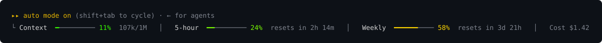

# usage-live

A Claude Code plugin. It draws one line under the prompt with the context fill, the 5-hour and weekly limits, and the session cost. Each bar changes from green at 0% to red at 100%.



_The image shows example figures. It is drawn from the same text and colors that the plugin draws._

## Install

Install it from the `bodypas-mods` marketplace:

```
/plugin marketplace add bodypas/claude-mods
/plugin install usage-live@bodypas-mods
```

## Develop

```
claude plugin validate .
claude plugin test .
```
